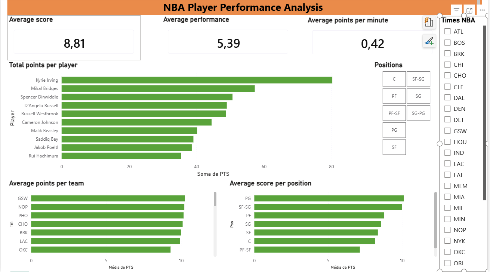

# NBA Player Performance Analysis

> Pipeline completo de dados e dashboard interativo para análise de eficiência de jogadores da NBA usando Python, MySQL e Power BI.

---

## 🌐 Language / Idioma

- [🇧🇷 Português](#-visão-geral)
- [🇺🇸 English](#-overview)

---

<br>

# 🇧🇷 Versão em Português

---

## 📌 Visão Geral

Este projeto entrega um fluxo completo de análise de dados — desde a ingestão de CSV bruto até um dashboard interativo no Power BI — permitindo insights profundos sobre performance, eficiência e padrões de pontuação de jogadores da NBA por time e posição.

---

## 🖥️ Preview do Dashboard



---

## 🎬 Demonstração

https://github.com/GustavoSousa777/nba-data-analysis/assets/dashboard_demo.mp4

> *Filtre por time ou posição e explore a eficiência dos jogadores em tempo real.*

---

## ⚙️ Tecnologias Utilizadas

| Camada | Ferramentas |
|---|---|
| Processamento de Dados | Python · Pandas · NumPy |
| Armazenamento | MySQL |
| Visualização | Power BI |
| Ambiente | requirements.txt |

---

## 🗂️ Estrutura do Projeto

```
nba-data-analysis/
│
├── assets/
│   └── dashboard_demo.mp4  
│   └── dashboard.png
├── data/
│   └── nba_data_processed.csv       # Dataset
│
├── src/
│   └── analysis.py                  # Pipeline de processamento
│
├── dashboard/
│   └── nba_dashboard.pbix           # Arquivo Power BI
│
├── README.md
└── requirements.txt
```

---

## 🔄 Pipeline de Dados

```
CSV Bruto  →  Limpeza  →  Feature Engineering  →  MySQL  →  Power BI
```

---

## 🧹 Limpeza de Dados

- **Dataset:** 649 linhas × 29 colunas
- Remoção de linhas completamente vazias → **624 registros válidos**
- Percentuais de arremesso nulos (`FG%`, `3P%`, `2P%`, `eFG%`, `FT%`) preenchidos com `0`, assumindo ausência de tentativas

```python
df = df.dropna(how='all')
df[shooting_cols] = df[shooting_cols].fillna(0)
```

---

## 📐 Feature Engineering

Quatro métricas personalizadas foram criadas para avaliar performance além dos pontos brutos:

| Métrica | Fórmula | Objetivo |
|---|---|---|
| `PTS_per_min` | `PTS / MP` | Eficiência de pontuação por minuto |
| `AST_per_game` | `AST / G` | Volume de assistências |
| `TRB_per_game` | `TRB / G` | Volume de rebotes |
| `Score` | `(PTS×0.5) + (AST×0.2) + (TRB×0.2) − (TOV×0.1)` | Índice composto de performance |

### Classificação de Jogadores

Jogadores foram classificados como **Elite** ou **Regular** com base em `PTS` e `PTS_per_min` acima da média — separando pontuadores de alto volume dos genuinamente eficientes.

---

## 🔍 Análises Realizadas

1. **Top 10 Pontuadores** — Ordenados por pontos totais (`PTS`)
2. **Top 10 Mais Eficientes** — Filtro `MP ≥ 10`, ordenados por `PTS_per_min`
3. **Melhor Score Geral** — Ordenados pela métrica composta `Score`
4. **Pontos por Posição** — Agrupamento por `Pos`, média de `PTS`
5. **Pontos por Time** — Agrupamento por `Tm`, média de `PTS`

---

## 🗄️ Integração com MySQL

O DataFrame processado foi carregado em um banco MySQL para simular um pipeline de produção e demonstrar domínio em SQL.

**Etapas:**
1. Normalização de colunas (`%` → `pct`)
2. Conversão de `NaN` para `None` para compatibilidade SQL
3. Limpeza da tabela com `DELETE FROM nba_players`
4. Inserção em lote via `executemany`
5. Validação com `SELECT COUNT(*)`

---

## 📊 Dashboard Power BI

### KPIs
- Média de Pontos (`PTS`)
- Média do Score Composto
- Média de Pontos por Minuto (`PTS_per_min`)

### Gráficos
- Top 10 jogadores por pontos totais
- Média de pontos por time
- Média de pontos por posição

### Filtros
- Time (`Tm`)
- Posição (`Pos`)

---

## 💡 Principais Insights

- **Volume ≠ Eficiência:** Maiores pontuadores nem sempre são os mais eficientes — `PTS_per_min` revela um ranking diferente
- **Métrica Score** identifica jogadores completos que contribuem em múltiplas categorias estatísticas
- **Tendências por posição:** PG e SF-SG lideram em eficiência média de pontuação
- **Análise por time:** GSW, NOP e PHO lideram em média de pontos por jogador

---

## 🚀 Como Executar

```bash
# Clonar o repositório
git clone https://github.com/GustavoSousa777/nba-data-analysis.git
cd nba-data-analysis

# Instalar dependências
pip install -r requirements.txt

# Executar a análise
python src/analysis.py
```

---

## 📌 Próximos Passos

- [ ] Gráfico de dispersão: PTS vs PTS_per_min (volume × eficiência)
- [ ] Análise posicional expandida
- [ ] Comparação entre temporadas
- [ ] Modelo preditivo para classificação de jogadores

---

## 👤 Autor

**Gustavo Sousa**
[](https://www.linkedin.com/in/gustavosousa777)
[](https://github.com/GustavoSousa777)

---

<br>
<br>

---

# 🇺🇸 English Version

---

## 📌 Overview

This project delivers a complete data analysis workflow — from raw CSV ingestion to an interactive Power BI dashboard — enabling deep insights into NBA player performance, efficiency, and scoring patterns across teams and positions.

---

## 🖥️ Dashboard Preview


---

## 🎬 Live Demo

https://github.com/GustavoSousa777/nba-data-analysis/assets/dashboard_demo.mp4

> *Filter by team or position and explore player efficiency in real time.*

---

## ⚙️ Tech Stack

| Layer | Tools |
|---|---|
| Data Processing | Python · Pandas · NumPy |
| Storage | MySQL |
| Visualization | Power BI |
| Environment | requirements.txt |

---

## 🗂️ Project Structure

```
nba-data-analysis/
│
├── assets/
│   └── dashboard_demo.mp4  
│   └── dashboard.png
├── data/
│   └── nba_data_processed.csv       # Dataset
│
├── src/
│   └── analysis.py                  # Processing pipeline
│
├── dashboard/
│   └── nba_dashboard.pbix           # Power BI file
│
├── README.md
└── requirements.txt
```

---

## 🔄 Data Pipeline

```
Raw CSV  →  Data Cleaning  →  Feature Engineering  →  MySQL  →  Power BI
```

---

## 🧹 Data Cleaning

- **Dataset:** 649 rows × 29 columns
- Dropped fully empty rows → **624 valid records**
- Null shooting percentages (`FG%`, `3P%`, `2P%`, `eFG%`, `FT%`) filled with `0`, assuming no attempts were made

```python
df = df.dropna(how='all')
df[shooting_cols] = df[shooting_cols].fillna(0)
```

---

## 📐 Feature Engineering

Four custom metrics were created to evaluate player performance beyond raw points:

| Metric | Formula | Purpose |
|---|---|---|
| `PTS_per_min` | `PTS / MP` | Scoring efficiency per minute |
| `AST_per_game` | `AST / G` | Playmaking volume |
| `TRB_per_game` | `TRB / G` | Rebounding volume |
| `Score` | `(PTS×0.5) + (AST×0.2) + (TRB×0.2) − (TOV×0.1)` | Composite performance index |

### Player Classification

Players were labeled as **Elite** or **Regular** based on whether their `PTS` and `PTS_per_min` both exceeded the dataset average — separating high-volume scorers from genuinely efficient ones.

---

## 🔍 Analyses Performed

1. **Top 10 Scorers** — Ranked by total points (`PTS`)
2. **Top 10 Most Efficient** — Filtered by `MP ≥ 10`, ranked by `PTS_per_min`
3. **Overall Best Score** — Ranked by composite `Score` metric
4. **Points by Position** — Group-by `Pos`, mean `PTS`
5. **Points by Team** — Group-by `Tm`, mean `PTS`

---

## 🗄️ MySQL Integration

The processed DataFrame was loaded into a MySQL database to simulate a production-grade pipeline and demonstrate SQL proficiency.

**Steps:**
1. Column names normalized (`%` → `pct`)
2. `NaN` values converted to `None` for SQL compatibility
3. Table cleared with `DELETE FROM nba_players`
4. Bulk-inserted via `executemany`
5. Row count validated with `SELECT COUNT(*)`

---

## 📊 Power BI Dashboard

### KPIs
- Average Points (`PTS`)
- Average Composite Score
- Average Points per Minute (`PTS_per_min`)

### Charts
- Top 10 players by total points
- Average points by team
- Average points by position

### Filters
- Team (`Tm`)
- Position (`Pos`)

---

## 💡 Key Insights

- **Volume ≠ Efficiency:** High scorers are not always the most efficient players — `PTS_per_min` reveals a different ranking
- **Score metric** surfaces well-rounded players who contribute across multiple statistical categories
- **Position trends:** PG and SF-SG positions lead in average scoring efficiency
- **Team analysis:** GSW, NOP, and PHO lead in average points per player

---

## 🚀 Getting Started

```bash
# Clone the repository
git clone https://github.com/GustavoSousa777/nba-data-analysis.git
cd nba-data-analysis

# Install dependencies
pip install -r requirements.txt

# Run the analysis
python src/analysis.py
```

---

## 📌 Next Steps

- [ ] Scatter plot: PTS vs PTS_per_min (volume × efficiency)
- [ ] Expanded positional analysis
- [ ] Season-over-season comparison
- [ ] Predictive model for player performance classification

---

## 👤 Author

**Gustavo Sousa**
[](https://www.linkedin.com/in/gustavosousa777)
[](https://github.com/GustavoSousa777)
